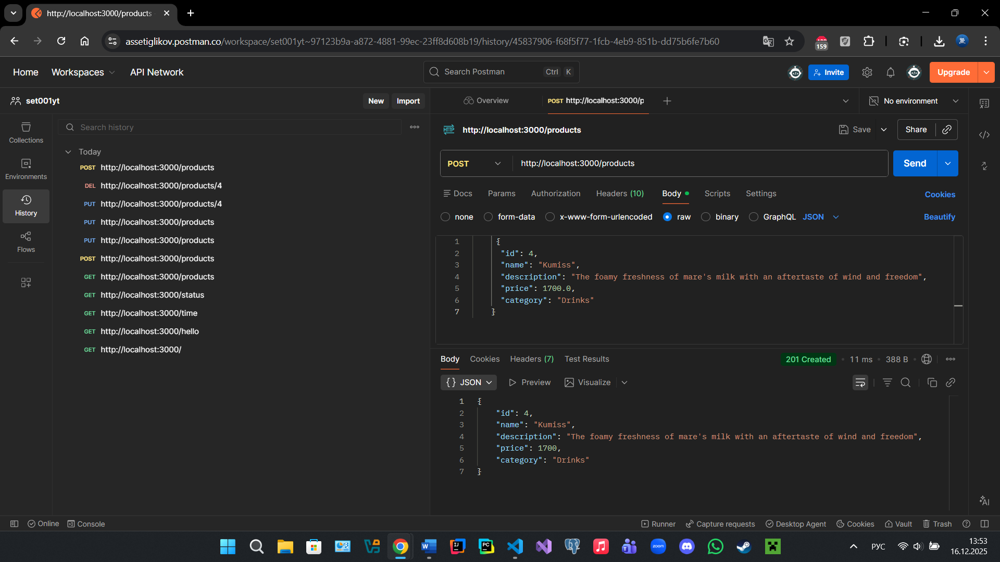

# Assignment #1 — Building Your First Express API (GET, POST, PUT, DELETE) with JSON Storage
Restaurant Management System - Express API with JSON Storage

Express.js REST API for managing a Kazakh restaurant menu with CRUD operations and JSON file storage.

##  Project Description

This is a backend API for a restaurant management system. The API allows managing products (menu items): create, read, update, and delete records.

**Chosen Object:** `Products` (menu items)

Each product contains:
- `id` - unique identifier (number)
- `name` - dish name (required field)
- `description` - dish description
- `price` - price in tenge
- `category` - category (Appetizers, Main Courses, Desserts, Drinks)

##  Installation and Setup

### Step 1: Clone the repository
```bash
git clone <your-repo-url>
cd restaurant-api
```

### Step 2: Install dependencies
```bash
npm install
```

This command will install all necessary packages from `package.json`:
- Express.js - web framework for building the API

### Step 3: Run the server
```bash
npm start
```

The server will start on `http://localhost:3000`

You will see in the console:
```
 Server is running on http://localhost:3000
```

##  List of API Routes

### Demo Routes (Test Routes)

| Method | URL | Description | Response |
|--------|-----|-------------|----------|
| GET | `/` | Check if server is running | "Server is running" |
| GET | `/hello` | JSON greeting | `{ "message": "Hello from server!" }` |
| GET | `/time` | Current server time | `{ "serverTime": "...", "timestamp": ... }` |
| GET | `/status` | Server status | `{ "status": "OK", "message": "Server is healthy" }` |

### CRUD Operations for Products

| Method | URL | Description | Required Data |
|--------|-----|-------------|---------------|
| GET | `/products` | Get all dishes | - |
| GET | `/products/:id` | Get one dish by ID | - |
| POST | `/products` | Create new dish | JSON in body |
| PUT | `/products/:id` | Update dish | JSON in body |
| DELETE | `/products/:id` | Delete dish | - |

##  Example Postman Requests

### Initial state of data.json

```json
{
  "products": [
    {
      "id": 1,
      "name": "Sorpa",
      "description": "A clear broth carrying the warmth of the hand that served the cup to the first guest",
      "price": 1800,
      "category": "Appetizers"
    },
    {
      "id": 2,
      "name": "Kazakh Et",
      "description": "A nomadic-inspired dish that combines meat and dough, often celebrated with dombra music.",
      "price": 31000,
      "category": "Main Courses"
    },
    {
      "id": 3,
      "name": "Chak-chak",
      "description": "Golden drops of dough, glued together with honey and children's holiday laughter",
      "price": 850,
      "category": "Desserts"
    }
  ]
}
```

---

### 1. GET - Retrieve all products

**Request:**
```
GET http://localhost:3000/products
```

**Status:** `200 OK`

**Response:**
```json
[
  {
    "id": 1,
    "name": "Sorpa",
    "description": "A clear broth carrying the warmth of the hand that served the cup to the first guest",
    "price": 1800,
    "category": "Appetizers"
  },
  {
    "id": 2,
    "name": "Kazakh Et",
    "description": "A nomadic-inspired dish that combines meat and dough, often celebrated with dombra music.",
    "price": 31000,
    "category": "Main Courses"
  },
  {
    "id": 3,
    "name": "Chak-chak",
    "description": "Golden drops of dough, glued together with honey and children's holiday laughter",
    "price": 850,
    "category": "Desserts"
  }
]
```

---

### 2. POST - Create a new product

**Request:**
```
POST http://localhost:3000/products
Content-Type: application/json
```

**Body:**
```json
{
  "name": "Kumiss",
  "description": "The foamy freshness of mare's milk with an aftertaste of wind and freedom",
  "price": 1700,
  "category": "Drinks"
}
```

**Status:** `201 Created`

**Response:**
```json
{
  "id": 4,
  "name": "Kumiss",
  "description": "The foamy freshness of mare's milk with an aftertaste of wind and freedom",
  "price": 1700,
  "category": "Drinks"
}
```

---

### 3. GET - Retrieve a single product by ID

**Request:**
```
GET http://localhost:3000/products/4
```

**Status:** `200 OK`

**Response:**
```json
{
  "id": 4,
  "name": "Kumiss",
  "description": "The foamy freshness of mare's milk with an aftertaste of wind and freedom",
  "price": 1700,
  "category": "Drinks"
}
```

---

### 4. PUT - Update a product

**Request:**
```
PUT http://localhost:3000/products/4
Content-Type: application/json
```

**Body:**
```json
{
  "name": "Kumiss",
  "price": 1790.0
}
```

**Status:** `200 OK`

**Response:**
```json
{
  "id": 4,
  "name": "Kumiss",
  "description": "The foamy freshness of mare's milk with an aftertaste of wind and freedom",
  "price": 1790,
  "category": "Drinks"
}
```

**Note:** The price was updated from 1700 to 1790 tenge.

---

### 5. DELETE - Delete a product

**Request:**
```
DELETE http://localhost:3000/products/4
```

**Status:** `200 OK`

**Response:**
```json
{
  "success": true,
  "message": "Product with id 4 was deleted"
}
```

**Result:** Product with ID 4 has been deleted. A subsequent GET request to `/products` will no longer show it in the list.

---

### 6. Verification after deletion

**Request:**
```
GET http://localhost:3000/products
```

**Status:** `200 OK`

**Response:** Returns the original 3 products (without Kumiss):
```json
[
  {
    "id": 1,
    "name": "Sorpa",
    "description": "A clear broth carrying the warmth of the hand that served the cup to the first guest",
    "price": 1800,
    "category": "Appetizers"
  },
  {
    "id": 2,
    "name": "Kazakh Et",
    "description": "A nomadic-inspired dish that combines meat and dough, often celebrated with dombra music.",
    "price": 31000,
    "category": "Main Courses"
  },
  {
    "id": 3,
    "name": "Chak-chak",
    "description": "Golden drops of dough, glued together with honey and children's holiday laughter",
    "price": 850,
    "category": "Desserts"
  }
]
```

---

### Error Examples

#### 404 Not Found - product does not exist
**Request:**
```
GET http://localhost:3000/products/999
```

**Response:**
```json
{
  "error": "Product not found",
  "message": "Product with id 999 does not exist"
}
```

#### 404 Not Found - incomplete URL
**Request:**
```
PUT http://localhost:3000/products
```
(forgot to specify ID)

**Status:** `404 Not Found`

**Correct request:**
```
PUT http://localhost:3000/products/4
```

#### 400 Bad Request - missing required field
**Request:**
```
POST http://localhost:3000/products
```

**Body:**
```json
{
  "description": "Some description"
}
```
(missing "name" field)

**Response:**
```json
{
  "error": "Validation error",
  "message": "Field 'name' is required"
}
```

---

##  Project Structure

```
restaurant-api/
│
├── screenshots/
│   └── postman-tests.png  # Postman testing screenshot
│
├── server.js              # Main server file
├── data.json              # Data storage
├── package.json           # Project dependencies
├── package-lock.json      # Dependency versions
├── node_modules/          # Installed packages
├── .gitignore             # Ignored files
└── README.md              # Documentation
```

## 🛠️ Technologies

- **Node.js** (v14+) - JavaScript runtime
- **Express.js** (v4.18.2) - Web framework for building APIs
- **File System (fs)** - Built-in Node.js module for file operations

## ✅ Implemented Features

### Demo Routes
- ✅ GET `/` - check server status
- ✅ GET `/hello` - JSON greeting
- ✅ GET `/time` - current server time
- ✅ GET `/status` - server status

### CRUD Operations
- ✅ GET `/products` - retrieve all products
- ✅ GET `/products/:id` - retrieve a single product
- ✅ POST `/products` - create a new product
- ✅ PUT `/products/:id` - update a product
- ✅ DELETE `/products/:id` - delete a product

### Additional Features
- ✅ Data validation (checking required "name" field)
- ✅ Error handling (404, 400, 500)
- ✅ Automatic ID assignment
- ✅ Data persistence in JSON file
- ✅ Partial update support (can update only specific fields)

##  Middleware

The project uses:
- `express.json()` - middleware for parsing JSON in request body

##  Postman Testing Results

All routes have been successfully tested:

| Operation | URL | Method | Status | Result |
|-----------|-----|--------|--------|--------|
| Get all | `/products` | GET | 200 OK | ✅ Working |
| Get one | `/products/4` | GET | 200 OK | ✅ Working |
| Create | `/products` | POST | 201 Created | ✅ Working |
| Update | `/products/4` | PUT | 200 OK | ✅ Working |
| Delete | `/products/4` | DELETE | 200 OK | ✅ Working |
| Error 404 | `/products/999` | GET | 404 Not Found | ✅ Working |

**Note:** When testing a PUT request without specifying an ID (e.g., `PUT /products` instead of `PUT /products/4`), the API correctly returns a `404 Not Found` status.

### 📸 Testing Screenshot



*The screenshot shows all executed CRUD operations with request history on the left and execution results on the right. All requests completed successfully with correct status codes (200 OK, 201 Created).*
*Also, there's an example for "POST" request on this screenshot*

## Author
Name: Asset Iglikov 

Group: SE-2434 

Course name: WEB Technologies 2 (Back End) | Samat Tankeyev 

University/college: Astana IT University(AITU)

## License

ISC
